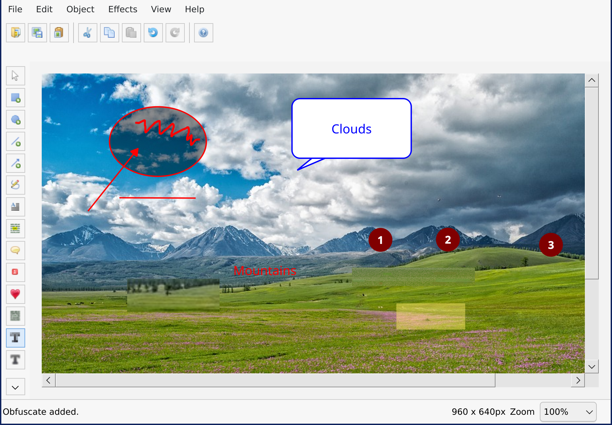

# Blueshot Editor

Blueshot is a port of Greenshot's editor for Linux. It brings in the powerful
photo annotation features.



Being easy to understand, Blueshot is an efficient tool for project managers,
software developers, technical writers, testers and anyone else creating
screenshots.

Blueshot is made to be used alongside other tools, such as `grim` and `slurp`.

This project is **not endorsed by the Greenshot team**, this is not a
fully-fledged port, it only ports the editor feature and is licensed under the
same GPL license.

## Usage

### With Nix

You may import this project as a flake, or run it directly:

```
nix run github:humaidq/blueshot
```

### Development

A Nix devshell is provided. If you have nix-direnv setup on your system, it should load automatically. Otherwise:

```
nix develop
```
